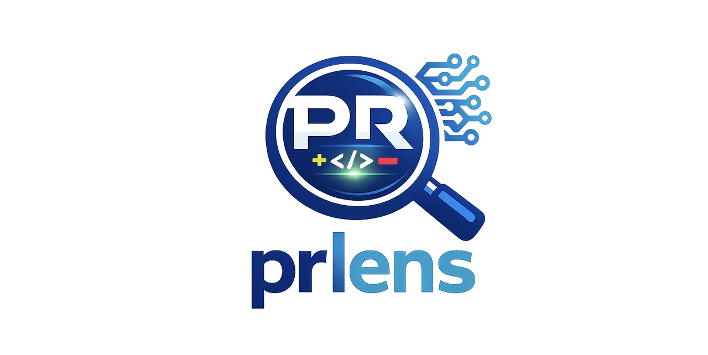

# PR Lens

[](https://github.com/prlens/prlens/actions/workflows/ci.yml)
[](https://codecov.io/gh/prlens/prlens)
[](https://pypi.org/project/prlens/)
[](https://pypi.org/project/prlens/)

AI-powered GitHub PR code reviewer for teams. Reviews each changed file against your coding guidelines using Claude or GPT-4o, posts inline comments on GitHub, and keeps a shared history of past reviews.



## Features

- **Codebase-aware** — injects co-change history, directory siblings, and paired test files into every review so the AI understands context beyond the diff
- **Language-agnostic** — context signals are based on git history and filename patterns, not import parsing; works identically for Python, Go, TypeScript, Ruby, Rust, and more
- **Team history** — stores review records in a shared GitHub Gist (zero infra) or local SQLite; query with `prlens history` and `prlens stats`
- **Zero onboarding friction** — `prlens init` creates `.prlens.yml`, provisions the team Gist, and generates the GitHub Actions workflow in one command
- **GitHub CLI fallback** — resolves your GitHub token from an existing `gh auth login` session; no PAT copy-paste required for local runs
- Supports **Anthropic Claude** and **OpenAI GPT-4o** as AI backends
- Bring your own guidelines via a Markdown file
- Posts inline review comments via the GitHub Review API
- Incremental reviews — only reviews files changed since the last review, not the whole PR again
- Prevents duplicate comments across repeated runs

---

## Packages

prlens is structured as a monorepo with three independently installable packages:

| Package | PyPI name | Purpose |
|---|---|---|
| `packages/core` | `prlens-core` | Review engine: providers, context gathering, orchestration |
| `packages/store` | `prlens-store` | Pluggable history: NoOpStore, GistStore, SQLiteStore |
| `packages/cli` | `prlens` | CLI: `review`, `init`, `history`, `stats` |

Installing `prlens` pulls in `prlens-core` and `prlens-store` automatically.

---

## Installation

```bash
pip install 'prlens[anthropic]'   # Claude (default)
pip install 'prlens[openai]'      # GPT-4o
pip install 'prlens[all]'         # both providers
```

---

## Quick Start

### Option A: Zero-friction team setup (recommended)

```bash
pip install 'prlens[anthropic]'
prlens init
```

`prlens init` will:
1. Detect your GitHub repo from `git remote`
2. Create `.prlens.yml` with your chosen provider
3. Create a shared GitHub Gist for team review history (via `gh` CLI)
4. Generate `.github/workflows/prlens.yml` so CI runs automatically on every PR

After `init`, every developer on the team can run:
```bash
prlens review --repo owner/repo --pr 42
```

No PAT setup required if they have `gh` installed and are logged in.

### Option B: Manual quick start

```bash
export GITHUB_TOKEN=ghp_...
export ANTHROPIC_API_KEY=sk-ant-...

prlens review --repo owner/repo --pr 42 --model anthropic
```

Omit `--pr` to list open PRs and pick one interactively.

---

## GitHub Action

Add this workflow to automatically review every pull request:

```yaml
# .github/workflows/code-review.yml
name: Code Review

on:
  pull_request:
    types: [opened, synchronize, reopened]

jobs:
  review:
    runs-on: ubuntu-latest
    steps:
      - uses: prlens/prlens/.github/actions/review@v0.1.8
        with:
          model: anthropic
          github-token: ${{ secrets.GITHUB_TOKEN }}
          anthropic-api-key: ${{ secrets.ANTHROPIC_API_KEY }}
```

Or use `prlens init` to generate this file automatically with the correct secrets and permissions.

---

## CLI Reference

```
Usage: prlens [OPTIONS] COMMAND [ARGS]...

  AI-powered GitHub PR code reviewer for teams.

Options:
  --config TEXT  Path to the configuration file. [default: .prlens.yml]
  --help         Show this message and exit.

Commands:
  review   Run AI review on a pull request
  init     Interactive team setup wizard
  history  Show past review records
  stats    Aggregated comment statistics
```

### `prlens review`

```
Usage: prlens review [OPTIONS]

Options:
  --repo TEXT                  GitHub repository (owner/name). [required]
  --pr INTEGER                 Pull request number. Omit to pick interactively.
  --model [anthropic|openai]   AI provider. Overrides config file.
  --guidelines PATH            Markdown guidelines file. Overrides config file.
  --config TEXT                Config file path. [default: .prlens.yml]
  -y, --yes                    Skip confirmation prompts.
  -s, --shadow                 Dry-run: print comments without posting to GitHub.
  --full-review                Review all files even if a previous review exists.
```

### `prlens init`

```
Usage: prlens init [OPTIONS]

  Set up prlens for your team.

  Creates .prlens.yml, optionally creates a shared GitHub Gist for team
  history, and generates a GitHub Actions workflow.

Options:
  --repo TEXT  GitHub repository (owner/name). Auto-detected from git remote.
```

### `prlens history`

```
Usage: prlens history [OPTIONS]

  Show past AI review records for a repository.

Options:
  --repo TEXT      GitHub repository (owner/name). [required]
  --pr INTEGER     Filter by PR number.
  --limit INTEGER  Maximum records to show. [default: 20]
```

### `prlens stats`

```
Usage: prlens stats [OPTIONS]

  Show aggregated review statistics for a repository.

Options:
  --repo TEXT   GitHub repository (owner/name). [required]
  --top INTEGER Number of top entries per category. [default: 10]
```

---

## Configuration

`.prlens.yml` in your repository root:

```yaml
# AI provider: anthropic | openai
model: anthropic

# Review history store: noop (default) | gist | sqlite
# store: gist
# gist_id: <gist-id>       # created automatically by `prlens init`
# store_path: .prlens.db   # only for store: sqlite

max_chars_per_file: 20000
batch_limit: 60

# Path to your team's coding guidelines (Markdown)
# guidelines: ./docs/guidelines.md

# Files/directories to skip — fnmatch globs or directory names
# exclude:
#   - migrations/
#   - "*.min.js"
#   - "*.lock"

# Review draft PRs (skipped by default)
review_draft_prs: false
```

---

## Team Review History

When a store is configured, prlens persists every review result. `prlens init` sets this up automatically using a private GitHub Gist — no server, no DB, no extra credentials.

```bash
# View recent reviews for a repo
prlens history --repo owner/repo

# View stats: severity breakdown + most-flagged files
prlens stats --repo owner/repo

# Filter history to a specific PR
prlens history --repo owner/repo --pr 42
```

---

## Codebase-Aware Reviews

prlens injects three types of context into every file review:

| Signal | Source | Why it helps |
|---|---|---|
| **Repository file tree** | Git tree at PR's head SHA | Lets the AI reason about layer boundaries, naming conventions, and test coverage |
| **Co-changed files** | Git commit history | Catches architectural coupling that isn't expressed via imports |
| **Paired test file** | Filename pattern matching | Avoids flagging already-tested behaviour; spots missing coverage |

All context is fetched from the GitHub API pinned to the PR's exact head SHA — no local filesystem, no stale state.

---

## Custom Guidelines

Point `guidelines` in `.prlens.yml` to any Markdown file with your team's coding standards:

```yaml
guidelines: ./docs/guidelines.md
```

Built-in defaults are in [`packages/core/src/prlens_core/guidelines/`](packages/core/src/prlens_core/guidelines/). Copy and customise them as a starting point.

---

## Environment Variables

| Variable | Required | Description |
|---|---|---|
| `GITHUB_TOKEN` | Yes (or `gh` CLI) | GitHub token with `pull_requests: write` |
| `ANTHROPIC_API_KEY` | When using Claude | Anthropic API key |
| `OPENAI_API_KEY` | When using GPT-4o | OpenAI API key |

If `GITHUB_TOKEN` is not set, prlens falls back to `gh auth token` (the token from your `gh auth login` session).

---

## Contributing

See [CONTRIBUTING.md](CONTRIBUTING.md) for development setup, running tests, and adding new AI providers.

## License

[MIT](LICENSE)
